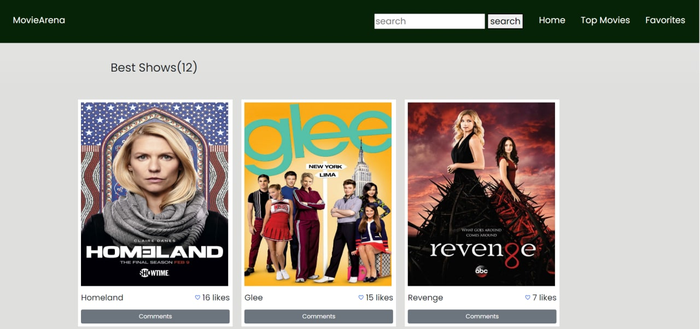

# MovieArena

This website presents the best Tv shows. We have used TVmaze API to get the movie content. we have used Javascript, HTML and CSS to build the website.
## Overview

## Built With

- JavaScript
- HTML
- CSS
## Over View

    

## Live Demo

[Live Demo Link](https://eyasuteshome.github.io/MovieArena/)

## Getting Started

To use this project you need to clone the repository to your local machine, and open the folder then run index.html file which is the main file of the project.

To get a local copy up and running follow these simple example steps.

### Prerequisites

To work on this project locally you need to have Node.js installed in your machine.

### Setup

To setup this project first you should have to clone the repository and the go to the projects directory and run npm install command to install the needed dependency. After that run npm start command to run the project from local server to http://localhost:8080/.

## Authors

👤 Eyasu Teshome

- GitHub: [@EyasuTeshome](https://github.com/EyasuTeshome)
- Twitter: [@EyasuTeshome](https://twitter.com/EyasuTeshome)
- LinkedIn: [Eyasu Teshome](https://linkedin.com/in/EyasuTeshome)

👤 Hatim

- GitHub: [@HatimDev](https://twitter.com/HatimDev)
- Twitter: [@HatimDev-HE](https://github.com/HatimDev-HE)
- LinkedIn: [@hatimdev](https://www.linkedin.com/in/hatimdev/)

## Show your support

Give a ⭐️ if you like this project!